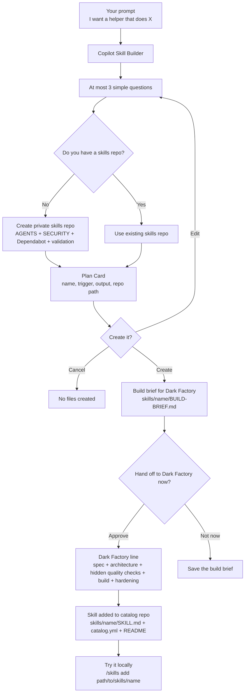

# 🧰 Copilot Skill Builder


Turn any prompt into a ready-to-review GitHub Copilot CLI skill.

Many people can describe what they want an AI assistant to do, but they might not know how to package that idea into something reusable. They may not know the prompts, YAML, repo structure, install steps, or skill design. So their ideas stay trapped in one-off chats.

Copilot Skill Builder changes that. It turns any prompt into a ready-to-review GitHub Copilot CLI skill.

Example: You type: “Build me a helper that summarizes my GitHub issues every morning.” It asks a few simple questions, shows a short plan, then hands the approved build brief to Dark Factory so the skill is created through the factory line.

> **⚡ One Command. That's It**
>
> **Never used the CLI before? No problem.** Paste this into your terminal:
>
> ```bash
> curl -fsSL https://raw.githubusercontent.com/DUBSOpenHub/copilot-skill-builder/main/quickstart.sh | bash
> ```
>
> When Copilot opens, type:
>
> ```text
> skill builder
> ```
>
> That's it — turn any prompt into a reusable Copilot skill. 🚀
>
> This installs **Copilot Skill Builder** and **Dark Factory** together, so the
> build handoff works when you approve it.
>
> *Requires an active [Copilot subscription](https://github.com/features/copilot/plans).*

## What it does

You describe the helper you want with any prompt. Copilot Skill Builder asks at most
three simple questions, asks where your skills should live, shows a short plan,
then sends the approved plan to [Dark Factory](https://github.com/DUBSOpenHub/dark-factory).
Dark Factory builds the complete skill folder with:

- `SKILL.md`
- `catalog.yml`
- `README.md`
- `WHAT_WAS_BUILT.md`

## How it works



Copilot Skill Builder is the front door. Dark Factory is the builder. When a
user says they want to build a skill, the approved plan goes through Dark
Factory's spec, architecture, hidden quality checks, validation, and hardening
flow.

At the end of the planning journey, Copilot Skill Builder asks:

```text
Ready to hand this to Dark Factory and build it?
```

Choose **Build with Dark Factory** to start the factory line.

## Skills catalog repo

Copilot Skill Builder assumes users should keep their skills together in one
repo. If they do not already have one, it offers to create a **private** skills
catalog repo by default.

The standard catalog repo includes:

- `README.md`
- `AGENTS.md`
- `SECURITY.md`
- `LICENSE`
- `.github/dependabot.yml`
- `.github/workflows/validate.yml`
- `skills/<skill-name>/` for every generated skill

Security settings should be enabled when GitHub allows it: vulnerability alerts,
Dependabot security updates, secret scanning, and push protection.

## Install

### One-command install

```bash
curl -fsSL https://raw.githubusercontent.com/DUBSOpenHub/copilot-skill-builder/main/quickstart.sh | bash
```

This installs Copilot Skill Builder plus Dark Factory, the build engine used
after you approve the Plan Card.

### Manual install

In GitHub Copilot CLI:

```text
/skills add DUBSOpenHub/copilot-skill-builder
/skills add DUBSOpenHub/dark-factory
```

Then start it with:

```text
copilot skill builder
```

or:

```text
skill builder
```

## Example

```text
skill builder
```

When asked what to build:

```text
Create a helper that summarizes the GitHub issues assigned to me each morning.
```

Copilot Skill Builder shows a short plan:

```text
Your new helper: Morning Issue Digest
Trigger: "morning digest"
What it does: Summarizes GitHub issues assigned to you.
What it uses: GitHub CLI
Where it will be saved: copilot-skills/skills/morning-issue-digest/
How to try it: /skills add copilot-skills/skills/morning-issue-digest
How to remove it: delete copilot-skills/skills/morning-issue-digest
```

After approval, Copilot Skill Builder hands the plan to Dark Factory, and Dark
Factory creates the skill files for you.

## Why this exists

Most people do not start by thinking, "I need a skill with this exact YAML and
prompt structure." They start with, "I wish Copilot could help me with this
workflow."

Copilot Skill Builder bridges that gap.

## Built by Dark Factory

Copilot Skill Builder was built with [Dark Factory](https://github.com/DUBSOpenHub/dark-factory), the sealed-envelope Copilot CLI build system.

It also uses the same pattern for users: Copilot Skill Builder shapes the prompt,
then Dark Factory builds the skill through its full line:

```text
Prompt → Plan Card → Dark Factory → Spec → Architecture → Hidden quality checks → Build → Validate → Harden → Skill
```

That means this repo is both a skill builder and a proof point: Dark Factory can
build real Copilot skills end-to-end.

## What it does not do

This MVP does not create dashboards, package managers, hosted services, plugin
systems, or background daemons. It creates prompt-only Copilot CLI skills that
are easy to inspect, install, customize, and delete.

## Validation

Run:

```bash
bash tests/check-skill-builder.sh
```

The validation checks YAML syntax, catalog references, required files, prompt
frontmatter, and line counts.

## License

Released under the [MIT License](LICENSE).

---

## Built with Love

🐙 Created with 💜 by @DUBSOpenHub with the GitHub Copilot CLI.

Let's build! 🚀✨
